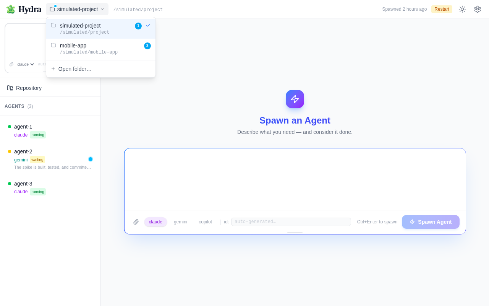

# Screenshots

Demo captures of the Hydra web UI, rendered from the simulation server.

These are generated by `web/scripts/screenshots/take-screenshots.ts` (Playwright +
headless Chromium against `hydra server --simulation`). To regenerate:

```sh
cd web && npm install
HYDRA_ARTIFACT_OUTPUT=/tmp/shots node scripts/screenshots/take-screenshots.ts
```

## unread-indicator



The unread-changes indicator (light + `-dark`). A sky-blue dot sits on the right
of any agent that went `running → waiting`/`finished` while you were away (agent-2
here); it clears when you open the agent. The project dropdown shows a per-project
unread count badge, and the folder button carries a small sky-blue dot when
*other* projects have updates waiting.

The left-hand status dot mirrors the status badge (e.g. agent-2 is yellow for
`waiting`, not green), so the two never disagree.
